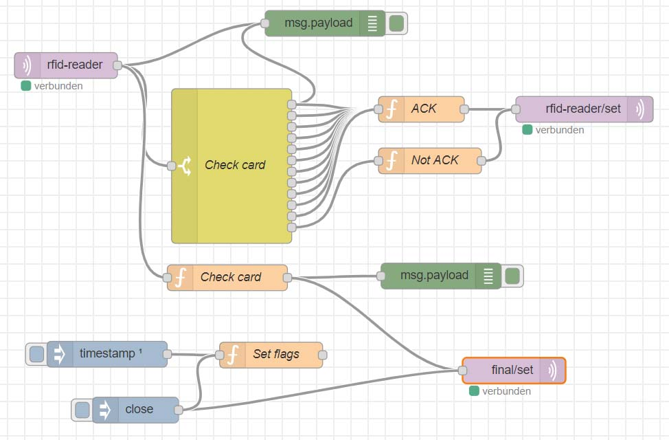

# RFID-Reader with MQTT
This device scans RFID-Chips and send the saved strings to a MQTT-Topic

## Hardware
 - NodeMCU (ESP8266/ESP-12E)
 - RFID-RC522
 - RFID-Tags

## Layout for RFID-Reader

| RFID-RC522| NodeMCU 	|
|:---------:|:---------:|
| VCC		| 3v3  		|
| RST		| D3		|
| GND		| GND		|
| MISO		| D6		|
| MOSI		| D7		|
| SCK		| D5		|
| NSS		| D8		|
| IRQ		| -			|

## NodeRed-Example

    [
    {
        "id": "ddf1517e.d64f8",
        "type": "debug",
        "z": "4029fc6d.c2c714",
        "name": "",
        "active": true,
        "tosidebar": true,
        "console": false,
        "tostatus": false,
        "complete": "payload",
        "targetType": "msg",
        "x": 470,
        "y": 100,
        "wires": []
    },
    {
        "id": "5cfa7f6.729a98",
        "type": "mqtt in",
        "z": "4029fc6d.c2c714",
        "name": "",
        "topic": "rfid-reader",
        "qos": "2",
        "datatype": "json",
        "broker": "d085fec.00d35",
        "x": 168,
        "y": 149,
        "wires": [
            [
                "f62a9e5c.31def",
                "ddf1517e.d64f8",
                "1de00a26.2047a6"
            ]
        ]
    },
    {
        "id": "f62a9e5c.31def",
        "type": "switch",
        "z": "4029fc6d.c2c714",
        "name": "Check card",
        "property": "payload",
        "propertyType": "msg",
        "rules": [
            {
                "t": "cont",
                "v": "2e24871a",
                "vt": "str"
            },
            {
                "t": "cont",
                "v": "f31c971e",
                "vt": "str"
            },
            {
                "t": "cont",
                "v": "317d481c",
                "vt": "str"
            },
            {
                "t": "cont",
                "v": "3189251c",
                "vt": "str"
            },
            {
                "t": "cont",
                "v": "31d1f11c",
                "vt": "str"
            },
            {
                "t": "cont",
                "v": "31f74e1c",
                "vt": "str"
            },
            {
                "t": "cont",
                "v": "3193741c",
                "vt": "str"
            },
            {
                "t": "cont",
                "v": "31f4571c",
                "vt": "str"
            },
            {
                "t": "cont",
                "v": "51e2071e",
                "vt": "str"
            },
            {
                "t": "cont",
                "v": "802c2d1c",
                "vt": "str"
            },
            {
                "t": "cont",
                "v": "c3d00519",
                "vt": "str"
            },
            {
                "t": "else"
            }
        ],
        "checkall": "true",
        "repair": false,
        "outputs": 12,
        "x": 361,
        "y": 266,
        "wires": [
            [
                "ddf1517e.d64f8",
                "c3c21652.364a78"
            ],
            [
                "c3c21652.364a78"
            ],
            [
                "c3c21652.364a78"
            ],
            [
                "c3c21652.364a78"
            ],
            [
                "c3c21652.364a78"
            ],
            [
                "c3c21652.364a78"
            ],
            [
                "c3c21652.364a78"
            ],
            [
                "c3c21652.364a78"
            ],
            [
                "c3c21652.364a78"
            ],
            [
                "c3c21652.364a78"
            ],
            [
                "c3c21652.364a78"
            ],
            [
                "ccbd0825.0858d8"
            ]
        ]
    },
    {
        "id": "1d15fbde.c46174",
        "type": "mqtt out",
        "z": "4029fc6d.c2c714",
        "name": "",
        "topic": "rfid-reader/set",
        "qos": "",
        "retain": "",
        "broker": "d085fec.00d35",
        "x": 772,
        "y": 200,
        "wires": []
    },
    {
        "id": "c3c21652.364a78",
        "type": "function",
        "z": "4029fc6d.c2c714",
        "name": "ACK",
        "func": "msg.payload=\"{\\\"ack\\\":1}\"\nreturn msg;",
        "outputs": 1,
        "noerr": 0,
        "x": 582,
        "y": 200,
        "wires": [
            [
                "1d15fbde.c46174"
            ]
        ]
    },
    {
        "id": "ccbd0825.0858d8",
        "type": "function",
        "z": "4029fc6d.c2c714",
        "name": "Not ACK",
        "func": "msg.payload=\"{\\\"ack\\\":0}\"\nreturn msg;",
        "outputs": 1,
        "noerr": 0,
        "x": 592,
        "y": 260,
        "wires": [
            [
                "1d15fbde.c46174"
            ]
        ]
    },
    {
        "id": "1de00a26.2047a6",
        "type": "function",
        "z": "4029fc6d.c2c714",
        "name": "Check card",
        "func": "switch(msg.payload.id){\n    case \"2e24871a\":\n        node.warn(\"Card 1 detected\");\n        global.set('flag1',1);\n        break;\n    case \"f31c971e\":  \n        node.warn(\"Card 2 detected\");\n        global.set('flag2',1);\n        break;\n    case \"317d481c\":   \n        node.warn(\"Card 3 detected\");\n        global.set('flag3',1);\n        break;\n    case \"3189251c\":  \n        node.warn(\"Card 4 detected\");\n        global.set('flag4',1);\n        break;\n    case \"31d1f11c\": \n        node.warn(\"Card 5 detected\");\n        global.set('flag5',1);\n        break;\n    case \"3193741c\": \n        node.warn(\"Card 6 detected\");\n        global.set('flag6',1);\n        break;\n    case \"31f74e1c\":   \n        node.warn(\"Card 7 detected\");\n        global.set('flag7',1);\n        break;\n    case \"51e2071e\": \n        node.warn(\"Card 8 detected\");\n        global.set('flag8',1);\n        break;\n    case \"802c2d1c\":\n        node.warn(\"Card 9 detected\");\n        global.set('flag9',1);\n        break;\n    case \"c3d00519\": \n        node.warn(\"Card 10 detected\");\n        break;\n}\nif(\n    global.get('flag1') === 1 &&\n    global.get('flag2') === 1 &&\n    global.get('flag3') === 1 &&\n    global.get('flag4') === 1 &&\n    global.get('flag5') === 1 &&\n    global.get('flag6') === 1 &&\n    global.get('flag7') === 1 &&\n    global.get('flag8') === 1 &&\n    global.get('flag9') === 1){\n    msg.payload = \"open\";\n    return msg;\n}\n",
        "outputs": 1,
        "noerr": 0,
        "x": 356,
        "y": 396,
        "wires": [
            [
                "b47798ca.a16d28",
                "5a525858.049128"
            ]
        ]
    },
    {
        "id": "b47798ca.a16d28",
        "type": "debug",
        "z": "4029fc6d.c2c714",
        "name": "",
        "active": true,
        "tosidebar": true,
        "console": false,
        "tostatus": false,
        "complete": "false",
        "x": 605,
        "y": 394,
        "wires": []
    },
    {
        "id": "cc3c96cb.8a64e8",
        "type": "inject",
        "z": "4029fc6d.c2c714",
        "name": "",
        "topic": "",
        "payload": "",
        "payloadType": "date",
        "repeat": "",
        "crontab": "",
        "once": true,
        "onceDelay": 0.1,
        "x": 216,
        "y": 485,
        "wires": [
            [
                "bdc1878b.57a9a8"
            ]
        ]
    },
    {
        "id": "bdc1878b.57a9a8",
        "type": "function",
        "z": "4029fc6d.c2c714",
        "name": "Set flags",
        "func": "global.set('flag1',0);\nglobal.set('flag2',0);\nglobal.set('flag3',0);\nglobal.set('flag4',0);\nglobal.set('flag5',0);\nglobal.set('flag6',0);\nglobal.set('flag7',0);\nglobal.set('flag8',0);\nglobal.set('flag9',0);\nreturn msg;",
        "outputs": 1,
        "noerr": 0,
        "x": 407,
        "y": 486,
        "wires": [
            []
        ]
    },
    {
        "id": "5a525858.049128",
        "type": "mqtt out",
        "z": "4029fc6d.c2c714",
        "name": "",
        "topic": "final/set",
        "qos": "",
        "retain": "",
        "broker": "d085fec.00d35",
        "x": 690.0000114440918,
        "y": 504.0000295639038,
        "wires": []
    },
    {
        "id": "2f7de392.ad213c",
        "type": "inject",
        "z": "4029fc6d.c2c714",
        "name": "",
        "topic": "",
        "payload": "close",
        "payloadType": "str",
        "repeat": "",
        "crontab": "",
        "once": false,
        "onceDelay": 0.1,
        "x": 249.10005569458008,
        "y": 550.0000057220459,
        "wires": [
            [
                "5a525858.049128",
                "bdc1878b.57a9a8"
            ]
        ]
    },
    {
        "id": "d085fec.00d35",
        "type": "mqtt-broker",
        "z": "",
        "name": "mqtt",
        "broker": "localhost",
        "port": "1883",
        "clientid": "",
        "usetls": false,
        "compatmode": true,
        "keepalive": "60",
        "cleansession": true,
        "birthTopic": "",
        "birthQos": "0",
        "birthPayload": "",
        "closeTopic": "",
        "closeQos": "0",
        "closePayload": "",
        "willTopic": "",
        "willQos": "0",
        "willPayload": ""
    }
    ]
[Download](rfid_reader_nodered.json)
